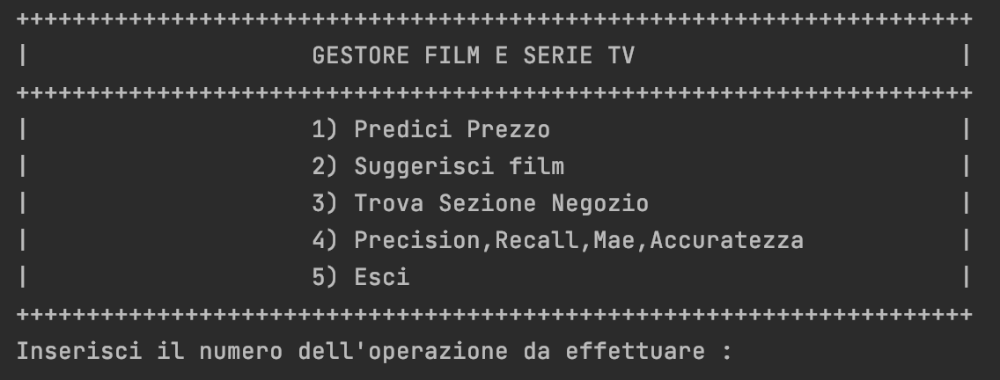
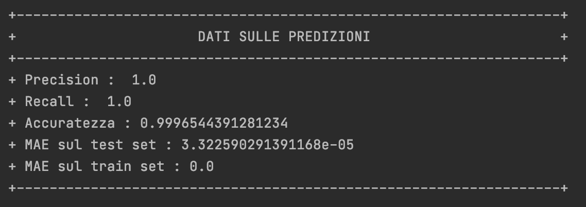
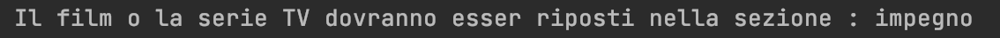

# Relazione tecnica

### Indice

1. [Introduzione](#Introduzione)
2. [Requisiti funzionali](#Requisiti-funzionali)
3. [Manuale utente](#Manuale-utente)
4. [Scelte progettuali](#Scelte-progettuali)
5. [Implementazioni future](#Implementazioni-future)
6. [Processo di sviluppo e organizzazione del lavoro](#Processo-di-sviluppo-e-organizzazione-del-lavoro)
7. [Conclusioni](#Conclusioni)

## **Introduzione**

Questo documento ha il compito di illustrare l’utilizzo della prima versione dell’applicazione **FRAVIT**.

L'applicativo software è stato sviluppato dal gruppo composto da: 

* **[Francesco Sasso](https://github.com/franklin2219)** (Matricola: 715742)
* **[Vito Musco](https://github.com/VitoMusco)** (Matricola: 724569)

Il nome dell'applicativo sono le iniziali del nome dei membri del gruppo.

L'assistente virtuale intelligente **FRAVIT** nasce con lo scopo di aiutare i negozi locali che si occupano della vendita
di film e serie TV in DVD, nel comprendere quale debba essere il prezzo,nel suggerire un determinato film o una serire TV
ai clienti che ne fanno richiesta e nel comprendere un nuovo film o serie TV in quale sezione del negozio debba essere posizionato.
(Suddivisi in base alle caratteristiche del film o della serie TV)

Si è scelto di utilizzare un dataset già preesistente in rete, in modo tale da poter utilizzare come base di conoscenza 
dei dati sufficienti per ottenere gli obiettivi stabiliti.
Sono state effettuate delle modifiche a tale dataset come l'inserimento delle colonne "voto_completo","durata_completa",
"anno_completo","genere_convertito" utilizzate per fornire degli esempi di prezzi dei film presenti nel dataset e per 
effettuare il suggerimento del film al cliente.


[Torna all'inizio](#Indice)

## **Requisiti funzionali**

Per avviare correttamente il programma è necessario installare:

* 'numpy' tramite il comando da terminale ```pip install numpy``` per la predizione;
* 'pandas' tramite il comando da terminale ```pip install pandas``` per il classificatore;
* 'sklearn.tree' tramite il comando da terminale ```pip install scikit-learn``` per il classificatore;
* 'matplolib' tramite il comando da terminale ``` pip install -U matplotlib``` per il classificatore;


[Torna all'inizio](#Indice)

## **Manuale utente**

La prima volta che si importa il progetto, la compilazione potrebbe richiedere qualche secondo in più!

Quando il programma sarà avviato verrà visualizzato la schermata principale a linea di comando:

<center></center>

Se avviato correttammente da questo momento in poi si potranno utilizzare i seguenti comandi:

* ```Predici Prezzo``` - comando che viene suggerito dal banner iniziale, e che se invocato permette di inserire i dati di un nuovo film che dovrà essere inserito nel negozio in modo tale da comprendere quale sarà il suo prezzo.
* ```Suggerisci Film``` - comando che viene suggerito dal banner iniziale, e che se invocato permette di inserire i dati relativi ai gusti del cliente permettendo a FRAVIT di suggerire uno tra i film presenti nel dataset e che rispetteranno i gusti forniti.
* ```Trova Sezione Negozio``` - comando che viene suggerito dal banner iniziale, e che permette di inserire i dati relativi al film/serieTV di cui si vuole comprendere la sezione e si otterrà la sezione nella quale quel determinato film/serieTV deve essere posto.
* ```Esci``` - comando per terminare l'applicazione.
* ```Precision,Recall,Mae``` - comando che viene suggerito dal banner iniziale, e che permette di visionare i dati relativi alla precision, alla recall ed al Mae sul train/test.

Inserendo il comando Precision,Recall,Mae verrà visualizzata la seguente schermata:

<center></center>

Una volta terminato correttamente il programma, verrà visualizzato a linea di comando il seguente messaggio:

<center>

```A presto!```

</center>

In seguito, l'applicazione verrà chiusa.
 
Vengono gestiti tutti i casi in cui l'utente inserisce un input errato!

Di seguito un esempio di interazione con il sistema nel caso si voglia comprendere il prezzo di un nuovo film/serieTV: 

<center></center>

Di seguito un esempio di interazione con il sistema nel caso si voglia suggerire film/serieTV:

<center></center>

Di seguito un esempio di interazione con il sistema nel caso si voglia comprendere la sezione di un nuovo film/serieTV:

<center></center>

[Torna all'inizio](#Indice)

## **Scelte progettuali**

Nel nostro applicativo software si è scelto di utilizzare:

* Una [base di conoscenza](https://it.wikipedia.org/wiki/Base_di_conoscenza), contente più di 207408 tra Film e SerieTv alla quale però sono state aggiunte informazioni necessarie per l'utilizzo dell'applicazione come:
  - ```genere_convertito``` utilizzato per la conversione del genere di un film/serie TV in valori numerici utili agli scopi progettuali (da 1 a 27)
  - ```voto_completo``` utilizzato per rappresentare il voto fornito dall'utente in un valore numerico utile agli scopi progettuali (da 1 a 4)
  - ```durata_completa``` utilizzata per rappresentare la durata del film/serie TV con dei valori numerici utili agli scopi progettuali (da 1 a 3)
  - ```anno_completo``` utilizzato per rappresentare l'anno di pubblicazione del film/serie TV con dei valori numerici utili agli scopi progettuali (da 1 a 4)
* Una [rete neurale](https://it.wikipedia.org/wiki/Rete_neurale_artificiale) in grado di predire il prezzo di un nuovo film/serieTV in base alle informazioni che gli verranno fornite. Per predire il prezzo analizzerà il voto ricevuto, l'anno di pubblicazione e la durata del film/serie TV.
* Un [K-nearest_neighbors](https://it.wikipedia.org/wiki/K-nearest_neighbors) in grado di suggerire un determinato film o una serieTV al cliente in base alle informazioni fornite in input che rappresenteranno le proprietà del film che si vorrà vedere.
Verrà richiesto il genere di film che si intende vedere,il periodo cinematografico che si preferisce vedere ed i livelli di humor,tensione,ritmo,erotismo,impegno richiesti.
* Un [albero di decisione](https://it.wikipedia.org/wiki/Albero_di_decisione) in grado di far comprendere in quale sezione del negozio dovrà essere posto un determinato film o una serie TV, in base alle caratteristiche inserite in input.
  - sezione 1 --> film o serie TV con maggior *humor*.
  - sezione 2 --> film o serie TV con maggior *ritmo*.
  - sezione 3 --> film o serie TV con maggior *impegno*.
  - sezione 4 --> film o serie TV con maggior *tensione*.
  - sezione 5 --> film o serie TV con maggior *erotismo*.
* [Precision e Recall](https://it.wikipedia.org/wiki/Precisione_e_recupero) come metriche di valutazione del sistema con l'utilizzo di una matrice di confusione.
<center></center>

### **Base di Conoscenza**

Dataset contenente informazioni relativi ai film e serie TV usciti durante gli anni. Contenente le seguenti colonne:
- filmtv_id;
- titolo_originale;
- titolo_italiano;
- anno;genere;
- durata;
- voto;
- humor;
- ritmo;
- impegno;
- tensione;
- prezzo;
- anno_completo;
- durata_completa;
- voto_completo;
- genere_convertito;
- sezione

### **Rete Neurale**

Il programma è stato dotato di una funzione che sfrutta un classificatore per determinare il prezzo a cui apparterrà un determinato film o una serie TV inseriti in input.
Abbiamo utilizzato un [file CSV](https://it.wikipedia.org/wiki/Comma-separated_values) per addestrare il nostro classificatore. Le informazioni che l'utente deve inserire sono:

* ```Titolo originale```;
* ```Titolo in italiano```;
* ```Anno```;
* ```Genere```;
* ```Durata```;
* ```Voto```;
* ```Humor```;
* ```Ritmo```;
* ```Impegno```;
* ```Tensione```;

Ad ogni campo sono stati associati i seguenti valori:

* Per il titolo originale ed il titolo in italiano, una stringa;
* Per l'anno, un intero successivamente modificato in :

<center>

| anno >= 2021 | anno >= 2012 | anno >= 2002 | altrimenti |
|---|--------------|--------|---------|
| 4 | 3           | 2       | 1       |

</center>

* Per il genere, una stringa successivamente modificato in :
<center>

| Animazione | Drammatico | Sentimentale | Commedia | Poliziesco |
|---|--------------|--------|---------|-------|
| 1 | 2            | 3       | 4       | 5     |

</center>

<center>

| Thriller | Avventura | Documentario | Horror | Azione |
|---|--------------|--------|---------|-------|
| 6 | 7            | 8       | 9       | 10     |

</center>
<center>

| Catastrofico | Western | Spionaggio | Biografico | Musicale |
|---|--------------|--------|---------|-------|
| 11 | 12            | 13       | 14       | 15     |

</center>

<center>

| Fantasy | Guerra | Grottesco | Gangster | Mitologico |
|---|--------------|--------|---------|-------|
| 16 | 17            | 18       | 19       | 20     |

</center>

<center>

| Storico | Noir | Supereroi | Biblico | Sportivo |
|---|--------------|--------|---------|-------|
| 21 | 22            | 23       | 24       | 25     |

</center>

<center>

| Sperimentale | Cortometraggio | 
|---|--------------|
| 26 | 27            | 

</center>
* Per il voto, un range di valori interi da 1 a 10 successivamente modificato in :

<center>

| voto >= 8 | voto >= 5 | voto >= 3 | altrimenti |
|---|--------------|--------|---------|
| 4 | 3           | 2       | 1       |

</center>

*Per la durata, un intero successivamente modificato in : 
<center>

| durata < 90 | durata < 120 | durata < 140 | altrimenti |
|---|--------------|--------|---------|
| 1 | 2           | 3       | 4       |

</center>

Il risultato della funzione ```Predici Prezzo ``` sarà il prezzo alla quale quel determinato film o serie TV potrà esser venduto.

**ESEMPIO PREDIZIONE PREZZO FILM/SERIE TV**:
<center></center>

### **K-nearest_neighbors**

Nel nostro applicativo è stata implementata una funzione che sfrutta il K-nearest_neighbors. Questo è in grado di suggerire un film o una serie TV presente all'interno del dataset. L'assistente, infatti, ponendo delle domande 
all'utente otterrà abbastanza dati per poter effettuare il suggerimento. In base ai dati:
* ```Genere``` del film o della serie TV che si desidera vedere;
* ```Anno```, periodo cinematografico del film o della serie TV che si desidera guardare;
* Livello di ```Humor``` del film o serie TV che si desidera guardare;
* Livello di ```Ritmo``` del film o serie TV che si desidera guardare;
* Livello di ```Impegno``` del film o serie TV che si desidera guardare;
* Livello di ```Erotismo``` del film o serie TV che si desidera guardare;
* Livello di ```Tensione``` del film o serie TV che si desidera guardare; 
  
Il risultato della funzione ```Suggerisci nuovo film ``` sarà un determinato film o serie TV in base agli input forniti.

**ESEMPIO SUGGERIMENTO FILM/SERIE TV**:
<center></center>


**ESEMPIO RETE NEURALE**:
---
Predizione prezzo in base a degli esempi di valori inseriti in input:

* Prezzo = 3 SE (voto = 1 ∧ anno = 1 ∧ durata = 1)
* Prezzo = 4 SE (voto = 2 ∧ anno = 1 ∧ durata = 1)
* Prezzo = 5 SE (voto = 1 ∧ anno = 3 ∧ durata = 1) 
* Prezzo = 6 SE (voto = 4 ∧ anno = 1 ∧ durata = 1)
* Prezzo = 7 SE (voto = 1 ∧ anno = 2 ∧ durata = 4) 
* Prezzo = 8 SE (voto = 3 ∧ anno = 3 ∧ durata = 2) 
* Prezzo = 9 SE (voto = 3 ∧ anno = 3 ∧ durata = 3) 
* Prezzo = 10 SE (voto = 4 ∧ anno = 4 ∧ durata = 2) 
* Prezzo = 11 SE (voto = 5 ∧ anno = 4 ∧ durata = 2) 
* Prezzo = 12 SE (voto = 8  ∧ anno = 2 ∧ durata = 2) 

[Torna all'inizio](#Indice)

### **Albero di decisione**
Nel nostro applicativo è stata implementata una funzione che sfrutta il DecisionTreeClassifier. 
Questo è in grado di suddividere un film o una serie TV in una determinata sezione presente all'interno del negozio, in base a delle caratteristiche del film/serie TV inseriti in input.
I dati che vengono utilizzati sono:
* Livello di ```Humor``` del film o serie TV ;
* Livello di ```Ritmo``` del film o serie TV ;
* Livello di ```Impegno``` del film o serie TV ;
* Livello di ```Erotismo``` del film o serie TV ;
* Livello di ```Tensione``` del film o serie TV ;

**ESEMPIO SUGGERIMENTO FILM/SERIE TV**:
<center></center>

## **Implementazioni future**

In futuro, alcune feature che potrebbero essere implementate sono:

1. Inserimento GUI;
2. Inserimento gestione noleggio film e serie TV;
3. Inserimento predizione mora su mancata restituzione di film o serie TV;

[Torna all'inizio](#Indice)

## **Processo di sviluppo e organizzazione del lavoro**

Il progetto è stato sviluppato a partire da fine gennaio 2022 fino a metà febbraio 2022, *completamente in remoto*.

## **Piattaforme di comunicazione**

Per la comunicazione, il nostro gruppo, ha adottato due piattaforme:

* **[Microsoft Teams](https://discord.com/brand-new)**
* **[Whatsapp](https://www.whatsapp.com/?lang=it)**

La prima è stata scelta poichè una piattaforma a tutti i membri del gruppo familiare, anche a causa del periodo pandemico attraversato,
la quale permetteva di organizzare videoconferenze e di condividere lo schermo.

Ciò è stato molto utile nel momento in cui sorgevano difficoltà in quanto si poteva risolvere il problema tutti insieme.

<center></center>

La seconda è stata scelta poichè era il mezzo di comunicazione più immediata. Tramite questa piattaforma, è stato possibile confrontarsi durante lo sviluppo, decidere i giorni e gli orari per le nostre chiamate e per tenerci contatto.

[Torna all'inizio](#Indice)

## **Conclusioni**

Come detto in precedenza, riteniamo che questo progetto sia stato un banco di prova. Nonostante le difficoltà riscontrate siamo riusciti comunque a rispettare gli obiettivi stabiliti e a trarre il meglio da questa esperienza formativa.

Rigraziamo per l'attenzione. 

<center>

Lo staff, **[FRAVIT]**

</center>

[Torna all'inizio](#Indice)